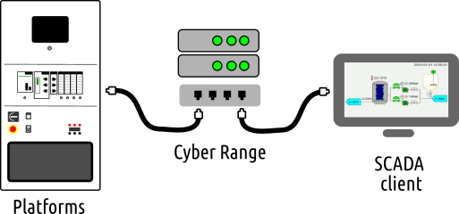

# Demo OPC-UA

This project showcases the interactions between a client and a server OPC-UA. The client receives the data and display them on the interface. It is also possible from the interface to send back data to the server.
The server in our use-case is a platform (siemens, crouzet, fischertecnik,...) when the client is a raspberry pi with a touchscreen. The architecture is depicted in the picture below.



Install
----------------------

Make sure you have ``python 3.5.2`` or newer installed. The interface is using ``PyQt5`` objects and opcua python library. After cloning the project, run the install file

```
git clone https://github.com/marcokome/OPC-UA_demo.git.
cd OPC-UA_demo
python3 install.py
```
You can then test the client as well as the server on your PC. Make sure the server is up first.

Server
---------

```
python3 opc_test_server.py
```
You should see the following result
```
Endpoints other than open requested but private key and certificate are not set.
Listening on {your_ip_adress}:4840
INDUSTRIAL_SHIELD_OPCUA_SERVER started at opc.tcp://{your_ip_adress}:4840
```

Client
-------------
```
python3 raspberry_client.py {server_ip_adress}
```

Troubleshooting
---------------
Please file at the [github issue tracker](issues).
